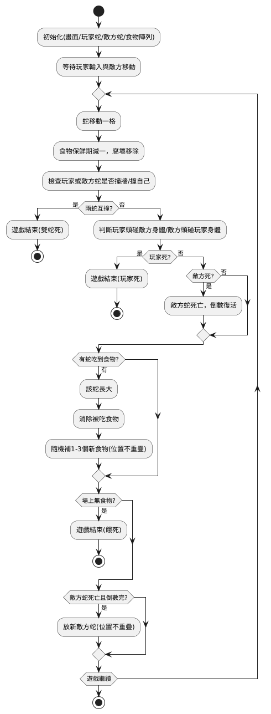
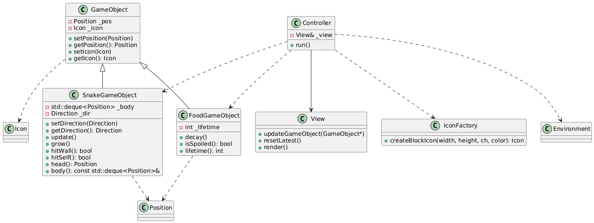

# 2025 OOP Assignment #7_2D Console Game
「蛇」麼都要吃

## 遊戲玩法
1.玩家控制自己的綠色蛇，與敵方的紅色蛇一起在地圖上行動。

2.玩家輸入方向(a往左，d往右，w往上，s往下)，蛇會往指定方向移動。

3.身體越長，移動速度越快。

4.地圖上會隨機產生食物：  

(1)蛇吃到食物後會變長(@是蛇頭，o是蛇身)。

(2)每個食物都有保存期限(60步)，過期會自動消失(剩餘的步數小於等於20步，食物變成紅色；剩餘的步數大於20步，小於等於40步，食物變成紫色，剩餘步數大於40步，食物顏色為黃色)。

(3)吃掉食物後，隨機生出1~3個食物。

4.當發生以下狀況時，玩家蛇死亡，遊戲結束：

(1)蛇撞到牆壁。

(2)蛇咬到自己(撞到自己的身體)。

(3)蛇撞到對方（玩家蛇與敵方蛇相撞，依碰撞狀況判斷是雙蛇同時死亡或單方死亡）。

(4)場上所有食物都被吃光。

5.敵方蛇死亡後，會在地圖上隨機復活。

## 遊戲流程圖

## UML類別圖

